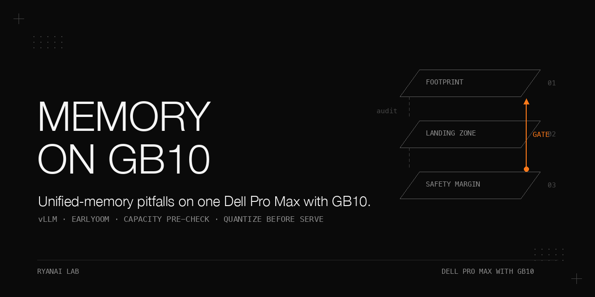

# Unified-memory pitfalls on the Dell Pro Max with GB10 — an incident book

> Seven incidents across a single node and a two-node pair of **Dell Pro Max with GB10** (121 GB unified memory, CPU and GPU share it, no discrete VRAM buffer): serving an unquantized BF16 merged checkpoint in vLLM, a dual-node GLM-5.3-Flash trial, and two consecutive A/B rounds against a community serving stack. The headline finding is that, in this configuration, GPU oversubscription on this platform did not produce a clean CUDA OOM — it produced whole-machine memory thrash in which the kernel stayed alive while userspace starved, and the only recovery we had was a physical power pull. That incident, and the loader failures that followed, forced a **capacity pre-check gate** (footprint estimate, landing-zone audit, safety margin, hard per-container memory cap) before any launch. The lessons are condensed at the end into a short list of standing rules. Every number below is reported with its measurement condition; the measurement logs and fact sheet behind them are not recorded in this repo. Where two recorded sources disagree, both numbers are shown.

## Why this matters

On a unified-memory box there is no discrete VRAM to catch an over-allocation — the GPU KV pool, the host page cache, and the model weights all draw from the same 121 GB. A misjudged launch does not fail fast; it thrashes the whole node until the kernel is up but `sshd` no longer answers, and in the incident recorded here the only fix that worked was a power pull. The defensive moves that followed (a footprint pre-check gate, a hard container cap, a retuned last-resort killer, a ban on bare BF16 serve, a deterministic head-load workaround) are the reusable part. They are written here so the next launch on this hardware does not relearn them by crashing a node.

## Hardware and stack

| Item | Value as recorded |
|---|---|
| Nodes | Head node and worker node, each **Dell Pro Max with GB10**, 121 GB unified memory; worker node has **no external network** (intranet only) — all images/weights are pulled on the head node and moved by `docker save\|load` / `rsync` (~273 MB/s observed over the 200GbE inter-node link) |
| Firmware memory carveout | 2 GB Display Reserved Memory, **not** included in `MemTotal` (affects all memory accounting) |
| Incident 1 model | A 27B-class BF16 checkpoint, 67 GB weights in 26 shards |
| Incident 1 flags | vLLM `GPU_MEMORY_UTILIZATION=0.90`, **no** container `--memory` cap; first launch failed at `torch.compile` AOT, relaunched with `--enforce-eager` |
| Incident 1 safe path | Existing eval-inference container recipe with `--memory=108g` hard cap |
| Incident 2 model/stack | GLM-5.3-Flash 320B-A18B, Entrpi EXL3 4bpw + DFlash2, dual-node TP2; control = DeepSeek-V4-Flash EXL3 single seat on the worker node (46.3 tok/s) and a four-tier 27B on the head node; GLM weight pin `2855072`, drafter pin `dc77ff1` (the weights repo these pins belong to is not recorded), ~166 GB retained on each node during the run |
| Incident 2 image quirk | Self-built NFS server image (`erichough/nfs-server` has no arm64): upstream source + three patches — `apk add libcap` (missing `capsh`), entrypoint tolerance for the new `capsh` `Current: =ep` shorthand, drop `--no-nfs-version 2` (removed in newer `nfs-utils`); the upstream version/Dockerfile/patch files and exact build commands are not recorded, and the two local image IDs are not recorded |
| Incident 3/4 stack under test | Community image `0rand/vllm_spark_dsv4-0.29-b12x` (10.8 GB), PILCOTHINK vLLM 0.28.1 lineage + Ollie config (marlin, `k=5`, vision/prefix-cache fixes); template changed in three lines only (PORT / served-name / MODEL_REVISION) |
| Reference stack (eugr recipe) | `eugr` recipe, KV pool 1.18M tokens (previous `anemll` recipe: 2.34M); cold start 12 min, warm start 3 min |
| Serving-knob delivery | A GPU-memory-utilization knob and its companions must be written straight into the per-model serve env file with shell default-value syntax (e.g. `: "${KNOB:=0.82}"`); the private installer only moves its `required` section, values written elsewhere are invalid and a re-install rewrites the env file (the installer, its env-file path and its loading logic are not recorded) |
| Last-resort guard | `earlyoom` (version not recorded); `EARLYOOM_ARGS="-M 524288,102400 -s 100 --avoid sshd"` in `/etc/default/earlyoom`. The two `-M` values are KiB memory thresholds (524288 KiB ≈ 512 MB, then 102400 KiB ≈ 100 MB) that trigger on available memory; `-s 100` sends SIGTERM at 100 % of the threshold; `--avoid sshd` skips any process whose name matches `sshd`. |
| Evaluation | Our private 11-category eval bank (questions not published); category names (e.g. `c1-kbqa` … `c10-sre-ops`) and item IDs may be cited, the question content is not published |

## How to reproduce

The incidents below were run in this order. Prerequisites we did **not** record and therefore cannot state: the exact head/worker node addresses (use `<HEAD_IP>` / `<WORKER_IP>`), the home-directory path for the evidence logs (use `~`), the exact kernel command line at each launch, the OS/kernel/driver/CUDA versions, the vLLM/PyTorch/loader versions, the public source of the weights, the complete launch commands, and the test inputs. Where the upstream repo for a pinned revision is not recorded, that is stated. If you need an address, path or version, mark it explicitly rather than guessing.

The capacity pre-check gate — run before any hardware-touching launch — is: (a) footprint = weight bytes (precision × params) + KV cache (`max_len × batch × layers × dim`, where `dim` is the hidden width; the KV term here is an order-of-magnitude estimate and omits the separate K and V copies, the per-element byte count, the number of KV heads and head_dim, and any sharding split — all of which raise the real footprint) + runtime overhead; (b) verify what is already running on the target node and its free memory; (c) require footprint ≤ available × 0.85, otherwise quantize / shard / change node — no bare launch; (d) require a container `--memory` hard cap and a reduced GPU utilization. Make a capacity-preflight item mandatory in the done-criteria of any hardware-touching work package, and gate launches that invoke `vllm serve`, large `docker run` on model volumes without `--memory`, and serve-path `FastLanguageModel.from_pretrained` before they run.

All result tables are reproduced complete in `docs/results.md` with a one-line note of the measurement conditions above each; all pitfalls are expanded in `docs/pitfalls.md`.

## The incidents, in chronological order

### Incident 1 — Bare BF16 serve thrash (2026-07-08)

#### What we saw
On the head node, an attempt to serve the BF16 merged checkpoint (67 GB weights, 26 shards) with vLLM at `GPU_MEMORY_UTILIZATION=0.90` and **no** container `--memory` cap. The first launch failed at `torch.compile` AOT; it was relaunched with `--enforce-eager`. `profile_run` made its tentative KV-cache allocation and the machine thrashed to a dead stop: the node became unreachable, remote kill was impossible, the kernel stayed alive (ping 0 % loss, 0.5 ms) but the `sshd` banner handshake timed out.

#### Why
On unified memory the 67 GB BF16 weights plus the `profile_run` tentative KV allocation are inferred to have crossed the 121 GB physical ceiling. We did not record the exact KV allocation size, a kernel-OOM log, or a memory trace, so the crossing is an inference from the observed thrash, not a measured allocation. With no `--memory` cap, nothing was sacrificed instead of the host — there is no discrete VRAM to reclaim, and the in-kernel OOM killer did not fire before userspace was starved in this run.

#### What fixed it
Recovery required a **physical power pull** — in this run, no software action could reach the box; this is not a claim that every oversubscription can only be recovered by pulling power. Going forward: quantize first (NVFP4 ≈ 20 GB); impose a hard container `--memory` cap; place a permanent ban on bare BF16 serve; and prefer the existing memory-capped eval-inference container (`--memory=108g`) for verdict numbers. The episode was codified as the capacity pre-check gate above.

#### The number that proved it
67 GB weights / 26 shards against a 121 GB ceiling at `GPU_MEMORY_UTILIZATION=0.90`; recovery needed a physical power pull in this run. (The safe path: `--memory=108g`.)

### Incident 2 — Head-load OOM on the GLM-5.3-Flash dual-node trial (2026-08-30)

#### What we saw
Deploying GLM-5.3-Flash 320B-A18B (Entrpi EXL3 4bpw + DFlash2, dual-node TP2) over six rounds, the head was OOMKilled at shard ~109/120, reproducible on both NFS and local paths — the opposite of a reference machine's "--nfs fixes it" conclusion. Stability across the window: full-server init succeeded **1 of 5** rounds; the worker rank1 crashed natively 3× (exit `None`, no traceback, 5–20 s after flashinfer autotune/JIT; the exit code and timing resemble the upstream `sm_121` #4003 issue, but we did not record the upstream repo, issue text, or version to confirm they share a root cause), plus 1 TP-init deadlock (both GPUs at 0 %, silent after the head finished loading weights). A 120K needle prefill crashed the worker 19 s after JIT-building the prefill-chunk-metadata kernel, reproduced 2/2 → the tested 120K configuration was unusable 2/2 (other context lengths were not tested, so this does not extend to all ≥100K contexts).

#### Why
Head-side host memory exhausted during weight load. CUDA-free sits ~6 G below `MemAvailable`, so `free` overstates what CUDA can use; ~4.5 G of stray services on the head node consumed the slack. The path (NFS vs local) was not the cause.

#### What fixed it
A 48 GB temp swapfile (total 64 GB swap) + `vm.watermark_scale_factor=200` + a GPU-memory-utilization knob at 0.82, plus clearing the stray services — applied instead of shrinking the model. NFS vs local path does not matter. The trial was rolled back to the pre-existing seats and re-accepted (engine endpoint returned to a healthy state); GLM was not promoted.

#### The number that proved it
Swap peak **23 G**; of the six rounds, **3** reached the OOM at shard ~109/120 (the other three failed earlier — the deadlock and the native crashes — so the shard-109 OOM is a subset, not all six). Speed probes (same three prompts; GLM figures are a cold first round including JIT; whether the control seat was equally cold, and the exact input/output lengths, sampling parameters and repeat count, are not recorded): `zh_long` 16.0 vs control 22.1, `code_gen` 41.5 vs 35.9, `tool_smoke` 25.8 vs 31.2 (GLM TTFT 0.7 s); rollback acceptance same three prompts 22.2 / 39.0 / 29.8 (≈ prior baseline — no tolerance band or repeat count was set, so "≈" is a visual judgement, not an acceptance rule). Control = DeepSeek-V4-Flash EXL3 single seat on the worker node (46.3 tok/s; measurement conditions not recorded).

### Incident 3 — `earlyoom` over-trigger on the worker node (2026-08-30/31, audited 2026-09-04)

#### What we saw
During the GLM window, `Worker_TP` was SIGTERMed 2 min into a legitimate load; five SIGTERMs were recorded on 8/30–31. On 2026-09-04 a headless-vs-desktop audit on both nodes recorded the over-triggering at MemAvailable ≤ 7472 MB (measured 6.64 % / 8270 MB at audit time).

#### Why
The old `-m 6` kill line fired at MemAvailable ≤ 7472 MB — far too eager for a 121 GB unified-memory box where transient pressure during a legitimate load is normal.

#### What fixed it
Retuned the worker-node `earlyoom` to `EARLYOOM_ARGS="-M 524288,102400 -s 100 --avoid sshd"` (in `/etc/default/earlyoom`, backup `earlyoom.bak-20260917`). Comments must be on their own line — a trailing `#` on an `EnvironmentFile` line is parsed as an argument and the service refuses to start.

#### The number that proved it
The new free-<512-MB line is **14×** looser than the old kill line, and it behaved correctly in two later genuine OOMs (the InstantTensor blow-up and the fastsafetensors OOM — see Incidents 5 and 6).

### Incident 4 — Non-deterministic mmap load (2026-09-17, round 2 attempt 1)

#### What we saw
Identical loader on two identical nodes: the worker finished the load in 3 min, the head stuck 28 min in `routed_experts._load_w13`.

#### Why
Page-fault-driven mmap on unified memory is suspected to be non-deterministic; one 3-min vs 28-min divergence on two identical nodes is not enough to prove a mmap root cause (cache state, memory pressure, and version-controlled loaders were not held constant, and the cited upstream "slow mmap on this chip family" note is not recorded in this repo). One node's behaviour did not predict the other's in this run.

#### What fixed it
Never infer node A from node B; validate each loader per node and judge dead on a timer. (Judging dead on a timer does not fix the load — the divergence itself was not fixed, only bounded by the timer.)

#### The number that proved it
28 min single-thread 100 % CPU with **zero disk reads**, swap-out 150–360 MB/s on the head, while the worker cleared in 3 min.

### Incident 5 — InstantTensor host-RAM blow-up (2026-09-17, round 2 attempt 3 and round 3)

#### What we saw
The InstantTensor attempt (`--load-format instanttensor`): load reached 18 %, then both nodes went to ~120–123 G used / ~1 G available, the head swapping in. The later attempt — after a dry-run of the "missing loader mod" passed cleanly (`--check` / patch / MARKER / import all passed, then all five mods stacked in Ollie order with `rc=0`) — the real launch with `--load-format instanttensor` still blew host memory at 18 %.

#### Why
That image's InstantTensor implementation over-allocates host RAM on the **target model** itself. Round 2 had misattributed the blow-up to double-loading the draft; the stage counter proved that wrong. The mod dry-run gave false confidence — it proved the patch applies, not that it solves the problem. The "missing mod" theory from round 2 was wrong.

#### What fixed it
Stay on the reference image, which loads the full 156 G in 22 s on the same head. ("156 G" is the on-disk weight files across both nodes; the per-node resident bytes and the timing start/stop points are not recorded.) Gate attribution on stage counters before blaming a component.

#### The number that proved it
`Hybrid draft loading` counter = **0** (never reached the draft phase). Per-minute memory trace: 03:11:22 both nodes 6 G used; 03:12:23 both nodes 123 G used / 1 G available, head at 18 % (28 G of the full load), pace collapsing 417 → 112 MB/s; 03:13:00 / 03:13:12 the new 512 MB `earlyoom` line SIGTERMed `Worker_TP` twice; verdict taken in 4 minutes; after standby both nodes back to 4 G used / 117 G available. (The "123 G used / 1 G available" is `free`-reported; combined with the 2 GB firmware carveout, "used + available" does not sum to the 121 GB `MemTotal` — the trace is reported as recorded, not reconciled.)

### Incident 6 — Swap toxicity / loader death spiral (2026-09-17, round 2 attempts 4 and 5)

#### What we saw
Attempt 4 (`--safetensors-load-strategy eager`): after 2 min, `safetensors.torch.load` raised `KeyError 'F8_E8M0'` — in this image the Python safetensors path does not know the MXFP8 scale dtype; the mmap path's Rust `safe_open` did load it, but this proves only the tested paths, not that no other path supports the dtype. Attempt 5 (`--load-format fastsafetensors`): worker-node whole-machine OOM with memory at 0.41 % and swap at 100 %.

#### Why
Whole-shard DMA paths (fastsafetensors) and swap-assisted paths drain the same 121 GB pool. On unified memory, swap is not a shock absorber — it is a second drain on the same pool. The eager failure was a dtype gap in the image's Python safetensors.

#### What fixed it
Container hard caps plus the retuned `earlyoom` so the container dies, not the node. (No fix was attempted for the eager `KeyError` beyond recording that the mmap path's Rust `safe_open` is the only path that knows the MXFP8 scale dtype in this image.)

#### The number that proved it
Attempt 5: mem 0.41 % / swap 100 % at the moment of the node OOM; the new 512 MB `earlyoom` line sent SIGTERM (a signal log was recorded), but we recorded the signal, not a subsequent host-survival log, so this proves the line fired, not that the host stayed alive because of it. No throughput or quality numbers exist for any attempt — nothing reached the evaluation stage, so the community-claimed scores (93 for this stack, mean 91 across their matrix) could not be compared.

### Incident 7 — Post-churn KV `ValueError` on reference-stack restore (2026-09-17)

#### What we saw
Restoring the reference stack failed twice with a KV-size `ValueError`; the switch script (private — it tears down the old container with `docker rm -f`, relaunches the new one, then waits on a port probe; its public-facing behaviour is described in the `switch/stack-mode.sh` abstraction in the sibling repo dell-pro-max-gb10-vllm-stack-ab) waited 25 min each time before the launch was judged dead. The record shows the port never opened; it does not show a `/health` 200 coexisting with an inference failure, so "port answering" and "engine serving" cannot be distinguished from this record alone.

#### Why
After repeated container start/stop, CUDA-side free memory shrinks while `free` still showed only 4 G used. The available KV (9.6–9.9 GiB) was below the 10.06 GiB needed for the 1,048,320-token context.

#### What fixed it
Raised the utilization knob 0.85 → 0.87 (the image's own level) and made the switch script fail fast on `ValueError` / "died unexpectedly" instead of waiting on ports only. The 0.877 figure was recorded elsewhere as a ceiling; its denominator (fraction of which memory pool, at which accounting basis) is not recorded, so it is reported as a recorded number, not a derived one.

#### The number that proved it
Available KV 9.6–9.9 GiB < 10.06 GiB needed for the 1,048,320-token context; after the fix, up in 2 min and KV pool 1.18M → 1.50M tokens (+27 %).

### Same-protocol baseline, collected while the stack was down

During the standby while the stack was down (not yet restored) the earliest dual-node deployment was re-measured on the same protocol for the first time. Evaluation = our private 11-category eval bank (questions not published).

| Metric | Qwen3.8-27B NVFP4 (thinking-off) | DeepSeek-V4-Flash-0731 EXL3 single seat | eugr control |
|---|---|---|---|
| decode tok/s (serial) | 20.3 | 19.6 | 33 |
| cold prefill tok/s | 2031 | 1082 | 2096 |
| 6-stream aggregate tok/s (concurrent) | 90.6 | 20.6 (single seat serial, 117 s wall) | 77.6 |
| eval-bank K2 hardmode | 90, median round 6.5 s, SAFETY 1 | 92, median round 20.9 s, SAFETY 1 | 91, median round 7.5 s |
| K3① vision (6/6 = passes) | N/A | N/A | 6/6 |
| K3② 6-stream SVG (passes / attempts) | 5/6 | 6/6 (377 s) | 6/6 |

*Note: the "6-stream aggregate tok/s" column mixes a serial single-seat number (20.6) with concurrent six-stream aggregates (90.6, 77.6) — they are not the same metric and are listed separately above. The prior "50/50" entry was two passes out of two sub-probes (vision and SVG), not a single 50-token score; it is split into the two K3 rows above. Per-probe request totals, scheduling, and wall-clock definitions are not recorded.*

## What did not work

- **Bare BF16 serve on GB10** — never worked; in this configuration it killed the machine and the only recovery was a physical power pull. Permanently deprecated in favour of quantization (NVFP4 ≈ 20 GB).
- **GLM-5.3-Flash dual-node as a replacement seat** — init stability 1/5, three native worker crashes with no traceback, one TP deadlock, long-context unusable (2/2 reproduction at the tested 120K), and it lost two of three speed probes; not promoted.
- **All five community-stack loader attempts (four distinct loader configurations)** — every attempt died before evaluation (Incidents 4–6).
- **Round 3's modded community stack** — dry-run patches applied cleanly (all `rc=0`), yet the real launch still blew host memory at 18 %; the "missing mod" theory from round 2 was wrong (Incident 5).
- **`docker save|load` with digest-pinned images** — the load step drops the repo digest, so the worker's pinned reference misses and it tries to reach the internet (which it cannot). Fix: tag references plus an image-ID assertion on both nodes (the Docker version and exact `save`/`load`/`tag` commands are not recorded; the minimal form is `docker save <image> -o file.tar` on the head, `docker load -i file.tar` on the worker, then `docker tag <loaded-id> <reference>` and assert `docker inspect --format='{{.Id}}'` matches on both nodes).
- **Probing flags by running `vllm --help` in a GPU-less `docker run`** — produced zero output in this image; grepping the image's source for the flag was a workable check here, but it does not prove the current entry point accepts the flag, and one zero-output run does not prove `--help` is universally useless. The exact command, stdout/stderr, exit code, and timeout were not recorded.
- **Restoring the reference stack at the old utilization knob** — `ValueError` from insufficient KV cache, twice (Incident 7).
- **Waiting on ports only, in the switch script** — two dumb 25-minute waits before anyone judged the launch dead (Incident 7).

## Pitfalls

Expanded in `docs/pitfalls.md` (symptom / root cause / fix / how we found it).

## Standing rules

Distilled from the incidents above:

1. **Memory cap on the container.** Every hardware-touching launch gets a hard `--memory` cap; nothing launches bare. (Incident 1.)
2. **GPU memory-utilization ceiling.** Hold the GPU utilization ceiling: the pre-check rule uses footprint ≤ available × 0.85 (a footprint-to-available ratio). A separate 0.70 figure appears in one source and 0.85 in another as a "GB10 GPU utilization ceiling" — these are two recorded sources that disagree, and neither is given a derivation here. The post-churn fix used a 0.87 utilization knob, against a 0.877 ceiling recorded elsewhere (denominator not recorded). These three ratios have different denominators (footprint/available vs. utilization knob vs. a ceiling); they are not interchangeable.
3. **`earlyoom` threshold.** Use `-M 524288,102400 -s 100 --avoid sshd` (free < 512 MB), not the old `-m 6` (MemAvailable ≤ 7472 MB) line; comments on their own line. (Incident 3.)
4. **No large swap.** In the incidents recorded here, swap on unified memory acted as a second drain on the same 121 GB pool, not as a shock absorber. The one sanctioned use is the temporary 48 GB head-load swapfile, removed after load. We did not separately count disk-backed swap, compressed swap, or pinned/staging overhead, and the peak 23 G did not prove swap is safe — the swapfile's safe removal after load (creation, recovery, and removal steps) is not recorded. (Incidents 2 and 6.)
5. **Quantize before serving.** Never serve bare BF16; quantize first (NVFP4 ≈ 20 GB). (Incident 1.)
6. **Log dump before removal.** Dump logs before you remove a container or judge a launch dead — the round-3 verdict was taken in 4 minutes against a 28-minute first failure because the memory trace was already in hand. (Incidents 4 and 5.)

## Files

- `README.md` — this incident book
- `docs/results.md` — all result tables, complete, with measurement conditions
- `docs/pitfalls.md` — pitfalls expanded (symptom / root cause / fix / how we found it)
- `docs/make_banner.py` — banner generator (pure PIL; `pip install pillow`, version not pinned); run it to produce `docs/assets/banner.png`. The script falls back to `ImageFont.load_default()` if the macOS fonts (`HelveticaNeue.ttc`, `Menlo.ttc`) are missing, so on other platforms the layout stays pure-PIL but the typeface changes.
- `docs/assets/banner.png` — generated by `docs/make_banner.py` (not committed by this cookbook)

## License

Apache-2.0.
